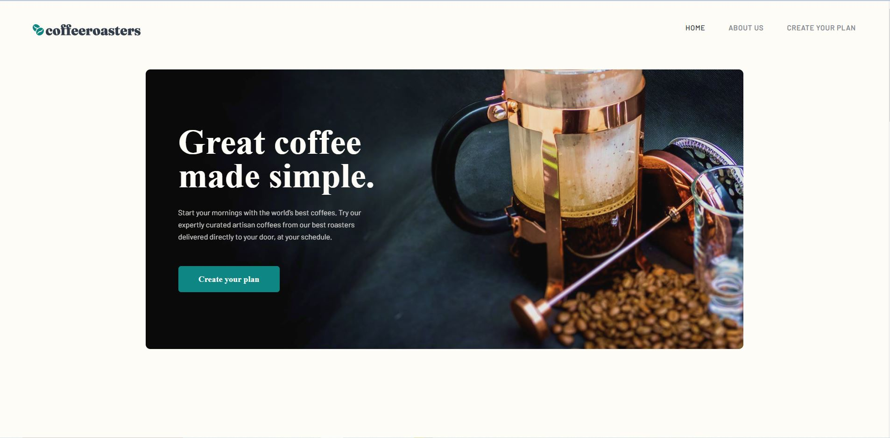

# Frontend Mentor - Coffeeroasters subscription site solution

This is a solution to the [Coffeeroasters subscription site on Frontend Mentor](https://www.frontendmentor.io/challenges/). Frontend Mentor challenges help you improve your coding skills by building realistic projects.

## Table of contents

- [Overview](#overview)
- [The challenge](#the-challenge)
- [Screenshot](#screenshot)
- [Links](#links)
- [My process](#my-process)
- [Built with](#built-with)
- [What I learned](#what-i-learned)
- [Continued development](#continued-development)
- [Author](#author)
- [Acknowledgments](#acknowledgments)

## Overview

### The challenge

Users should be able to:

- View the optimal layout for each of the website's pages depending on their device's screen size
- See hover states for all interactive elements on the page
- View each page and be able to toggle between the tabs to see new information
- See the correct states for the "Plan" section depending on which options are selected
- See correct checkout totals depending on the plan and number of bags selected

### Screenshot



### Links

- Solution URL: [Check solution URL here](https://github.com/muzardemoses/Coffeeroasters-subscription-site-solution)
- Live Site URL: [Check live site URL here](https://coffeeroasters-subscription-site-solution.vercel.app/)

## My process

### Built with

- Semantic HTML5 markup
- CSS custom properties
- Flexbox
- Mobile-first workflow
- [React](https://reactjs.org/) - JS library

### What I learned

```html
<h1>Some HTML code I'm proud of 🎉</h1>
```

```css
.proud-of-this-css {
  color: papayawhip;
}
```

```js
 const [menuOpen, setMenuOpen] = useState(false);

  const handleMenu = () => {
    const headerLinks = document.querySelector(".header-links");
    headerLinks.classList.toggle("open");

    const linkItem = document.querySelectorAll(".link-item");
    linkItem.forEach((item) => {
      item.addEventListener("click", () => {
        headerLinks.classList.remove("open");
        setMenuOpen(false);
      });
    });

    setMenuOpen((prev) => !prev);
  };

style={
              answerOne === " using Capsules"
                ? { pointerEvents: "none", opacity: "0.5" }
                : { pointerEvents: "auto", opacity: "1" }
            }


```

### Continued development

I will continue to develope my css skills especially in positioning areas and media queries to make my websites more responsive.

I will also learn more on React

## Author

- GitHub - [@MuzardeMoses](https://github.com/MuzardeMoses)
- Frontend Mentor - [@muzardemoses](https://www.frontendmentor.io/profile/muzardemoses)
- Twitter - [@Muzarde1](https://www.twitter.com/Muzarde1)
- LinkedIn - [Moses Adebayo](https://www.linkedin.com/in/muzardemoses/)
- Instagram - [@muzardemoses](https://www.instagram.com/ademuzardemoses/)
- Facebook - [Adebayo MuzardeMoses Olaoluwa ](https://facebook.com/ademuzardemoses)
- YouTube - [MuzardeMoses](https://www.youtube.com/channel/UCg4W7cbWu6dW_8oJEHWaP9w)

## Acknowledgments

I would like to thank [Richard Adebayo](https://www.linkedin.com/in/richardebrain/) and [Samuel Adebayo](https://www.linkedin.com/in/sambayo/) for their support and encouragement.


